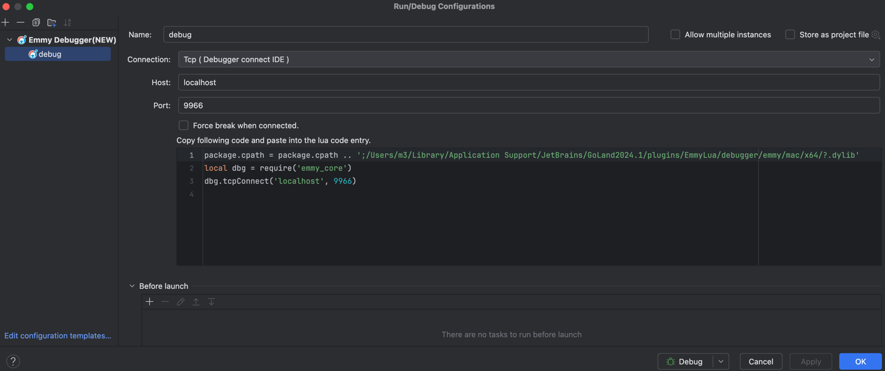
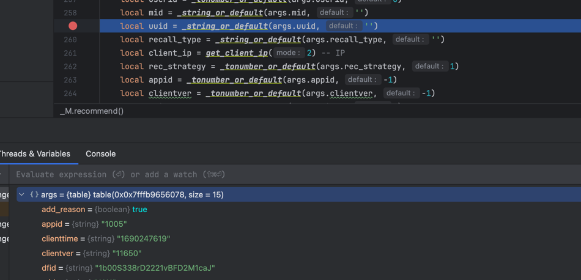

## Breakpoint Debugging for Lua Projects Deployed with OpenResty in Docker
### Steps
1. Add the image in the Dockerfile:

```dockerfile
FROM xuwudong/openresty-emmy-lua-debugger:1.92.3.1
```

2. Set the environment variable DEBUG_SOURCES_DIR to the root directory of the code to be debugged locally in the docker-compose.yml file:

``` docker
services:
    openresty:
        environment:
            - "DEBUG_SOURCES_DIR=$root_path_on_machine"
```

3. Pass the environment variable to NGINX:

``` nginx
env DEBUG_SOURCES_DIR;
```

4. Copy debug.lua to your local project and modify $root_path_on_container to the root directory where the local code is mounted in the container.
$ip should be the IP address of the Docker container connecting to the local machine (obtainable by executing ```ping host.docker.internal``` in the container).

``` lua
local _M = { _VERSION = '1.0' }
_G.emmy = {}
_G.emmy.fixPath = function(path)
    return string.gsub(path, $root_path_on_container, os.getenv('DEBUG_SOURCES_DIR') .. '/')
end
package.cpath = package.cpath .. ';/usr/local/emmy/?.so'

function _M:init_debug()
    local dbg = require('emmy_core')
    -- ping host.docker.internal in container
    dbg.tcpConnect($ip, 9966)
end

function _M:stop_debug()
    local dbg = require('emmy_core')
    dbg.stop()
end

return _M
```

5. In the common pre-processing calls of your project, add a call to debug:init_debug().

``` lua
    local debug = require 'debug'
    debug:init_debug()
--- do something
```

6. In the common post-processing calls of your project, add a call to debug:stop_debug().

``` lua
    --- do something
    local debug = require 'debug'
    debug:stop_debug()
```

7. Install the EmmyLua plugin in your local IDE (IntelliJ IDEA or goland).

8. Add a debug configuration in the IDE, select "Emmy Debugger (New)" and choose "Tcp (Debugger connect IDE)" for the Connection option.
   
9. Start the debug configuration in the IDE and add breakpoints in the corresponding code of the interfaces you want to debug.

10. Start the container using docker-compose, and access the container service locally.

11. The requests will attach to the IDE, allowing you to perform local breakpoint debugging.
    