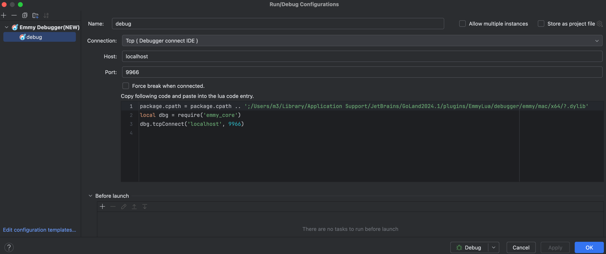
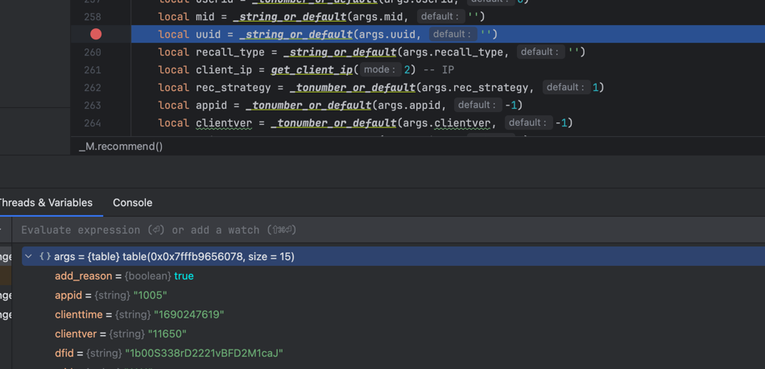

## 断点调试docker部署的openresty的lua项目
### 步骤
1. 在Dockerfile中添加镜像：
```dockerfile
FROM  xuwudong/openresty-emmy-lua-debugger:1.92.3.1
```

2. docker-compose设置环境变量DEBUG_SOURCES_DIR = 本地待调试代码的根目录
```docke-compose.yml
services:
    openresty:
        environment:
            - "DEBUG_SOURCES_DIR=$root_path_on_machine"
```

3. 设置环境变量到nginx
```nginx configuration
env DEBUG_SOURCES_DIR;
```

4. 复制debug.lua到本地项目下, 修改$root_path_on_container为本地代码挂载到容器中根目录。
$ip为docker容器连接本地机器的ip(在容器中执行 ping host.docker.internal 可以得到)
```lua debug.lua
local _M = { _VERSION = '1.0' }
_G.emmy = {}
_G.emmy.fixPath = function(path)
return string.gsub(path, $root_path_on_container, os.getenv('DEBUG_SOURCES_DIR') .. '/')
end
package.cpath = package.cpath .. ';/usr/local/emmy/?.so'

function _M:init_debug()
    local dbg = require('emmy_core')
    -- ping host.docker.internal in container
    dbg.tcpConnect($ip, 9966)
end

function _M:stop_debug()
    local dbg = require('emmy_core')
    dbg.stop()
end

return _M
```


5. 项目公共前置调用处添加调用debug:init_debug()
```lua
    local debug = require 'debug'
    debug:init_debug()
    --- do something
```

6. 项目公共后置调用处添加调用debug:stop_debug()
```lua
    --- do something 
    local debug = require 'debug'
    debug:stop_debug()
```

7. 本地idea安装插件EmmyLua

8. idea添加debug配置，选择Emmy Debugger(New), Connection选项选择 “Tcp(Debugger connect IDE)”


9. idea启动调试配置，在需要调试的接口对应代码添加断点

10. docker-compose启动容器，本地访问容器服务

11. 请求将attach到idea中，即可进行本地断点调试

